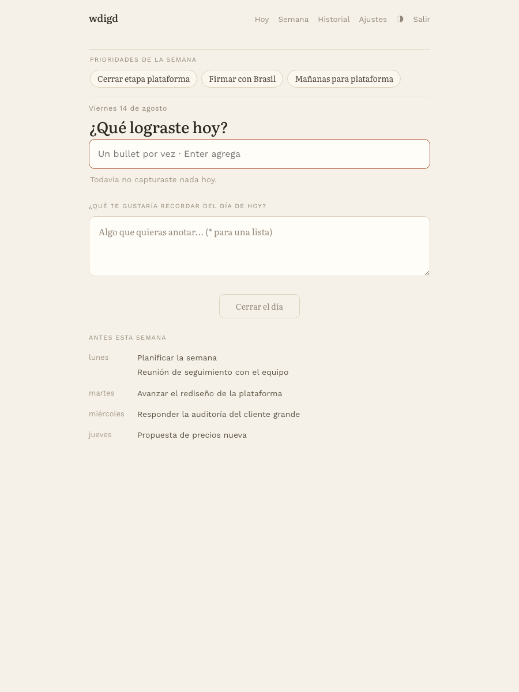
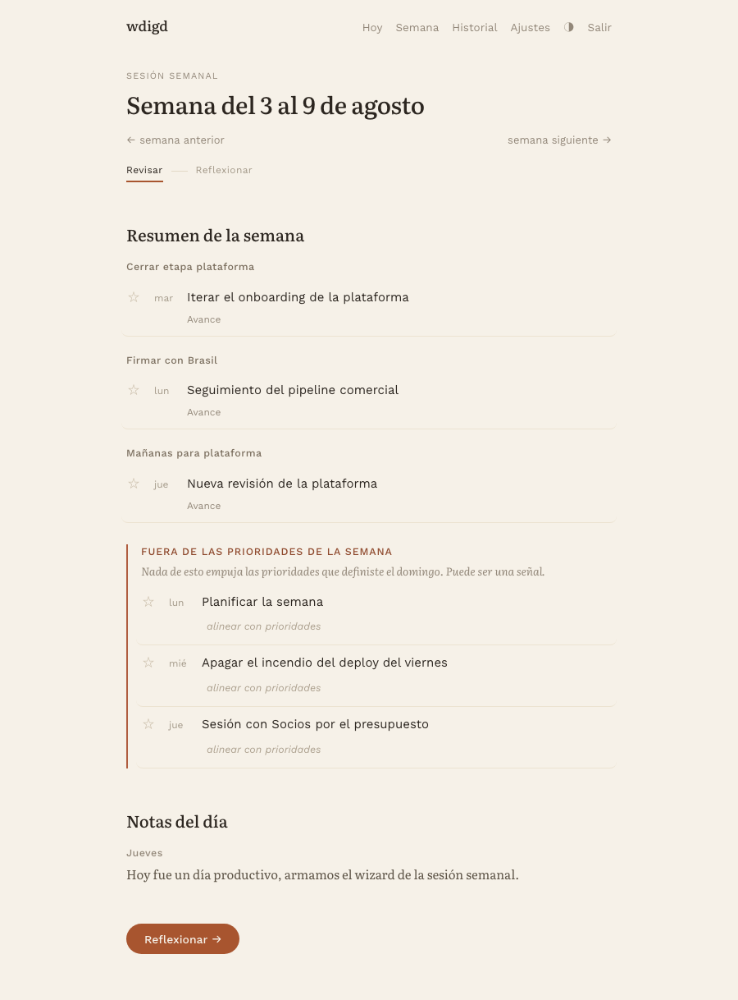

# wdigd

**What Did I Get Done** — a minimalist weekly journaling app. No AI, no streaks, no notifications.

Most weeks end with the feeling that you haven't advanced on anything. It's not true — you just didn't write it down. wdigd gives you two rhythms to fix that: a minute per day to capture what you got done, and half an hour per week to organize that material and decide what it meant.

**The app counts and orders; you judge and synthesize.** No language model writes reflection for you. No dashboards. No red badges when you skip a day.

> The app UI is in Rioplatense Spanish. This README, the code, and all internal docs are in English. Screenshots below show the Spanish interface — that's what users see.

<p align="center">
  
  
</p>

## What it does

- **Daily capture.** Answer one question — *"¿Qué lograste hoy?"* ("what did you get done today?") — with a few bullets. Optionally tag each as *Logro* (win), *Avance* (progress), or *Desbloqueo* (unblock), and align it with one of your weekly priorities. Optional means optional: a plain bullet looks complete, not pending.
- **Weekly session.** At the end of the week, everything you captured shows up ordered and counted: how many days you wrote, which priorities got traction, what fell outside them. You write your own highlights, observations, and takeaways. That's what lives in the archive.
- **Neutral by design.** "You captured 4 out of 7 days" reads the same as "7 out of 7". No red alerts, no warning icons, no challenge copy.

## Who this is for

- People who already know weekly reflection helps them, but want a place to do it without vanity metrics, gamification, or an algorithm summarizing their story back to them.
- Anyone who's tried journaling apps and quit because they nagged, streaked, or auto-summarized.
- Self-hosters who prefer running one small Python app over trusting another SaaS with their private notes.

## Watch it in action

1-minute video walkthrough: https://youtu.be/IXV3VUoDk_4

## Stack

Python 3.12 · FastAPI · SQLAlchemy 2 · Alembic · PostgreSQL (SQLite for local dev). Server-rendered frontend with Jinja2 + HTMX and hand-written CSS. No build step.

## Run it locally

### Option A: Docker (one command, includes Postgres)

```bash
cp .env.example .env
docker compose up --build
```

Open http://localhost:8000. To load four weeks of fake data:

```bash
docker compose exec app python seed.py
```

That creates a user `demo@wdigd.local` with password `demo1234`. Development use only.

### Option B: venv + SQLite

```bash
python3.12 -m venv .venv
source .venv/bin/activate
pip install -r requirements.txt
alembic upgrade head
uvicorn app.main:app --reload
```

## Environment variables

| Variable | Default | Purpose |
|---|---|---|
| `DATABASE_URL` | `sqlite:///./wdigd.db` | Database URL. `postgres://` is normalized to `postgresql://`. |
| `SECRET_KEY` | development key | Signs the session cookie. **Required in production.** |
| `SECURE_COOKIES` | `false` | Set `true` in production so the session cookie is HTTPS-only. |
| `GOOGLE_CLIENT_ID` | — | Enables the optional Google Calendar integration. |
| `GOOGLE_CLIENT_SECRET` | — | Same. |
| `GOOGLE_REDIRECT_URI` | inferred | Only needed if your deploy has to pin it explicitly. |

Generate a strong `SECRET_KEY`:

```bash
python -c "import secrets; print(secrets.token_urlsafe(48))"
```

## Google Calendar (optional)

To see your calendar events under `/today`, follow [docs/google-cloud-setup.md](docs/google-cloud-setup.md) to create an OAuth client and set the three `GOOGLE_*` variables. Without them the feature stays disabled and the settings section doesn't appear.

## Deploy

- Railway: see [docs/deploy-railway.md](docs/deploy-railway.md).
- Any PaaS that runs a `Dockerfile` or `Procfile` (uvicorn + managed Postgres) should work with no changes.

## Migrations

```bash
alembic revision --autogenerate -m "description"
alembic upgrade head
```

## Code map

```
app/
  main.py            FastAPI app, session middleware, login redirect
  config.py          settings from env vars
  db.py              engine, sessionmaker, Base, get_db dependency
  deps.py            get_current_user and LoginRequired
  security.py        password hashing and verification
  users.py           user lookup by email
  weeks.py           dates, ISO weeks, user timezone
  capture.py         reading bullets and parsing the capture field
  priorities.py      which priorities apply to each week
  observations.py    block 2 of the weekly session, computed on the fly
  week_material.py   blocks 1-3 of the weekly session (HTMX fragment)
  templating.py      Jinja globals, filters, cache-busting
  models/            User, Entry, WeeklyReview, Achievement, DailyNote
  routers/           auth, today, entries, week, history, settings, calendar
  templates/         base, pages/, components/
  static/            css/main.css, js/app.js
alembic/             migrations
seed.py              fake data for development
```

Routers are HTTP glue: they validate, delegate to domain modules, and return a template. Logic shared across screens lives in the flat modules under `app/`.

## Development conventions

See [CLAUDE.md](CLAUDE.md).

## License

MIT — see [LICENSE](LICENSE).
